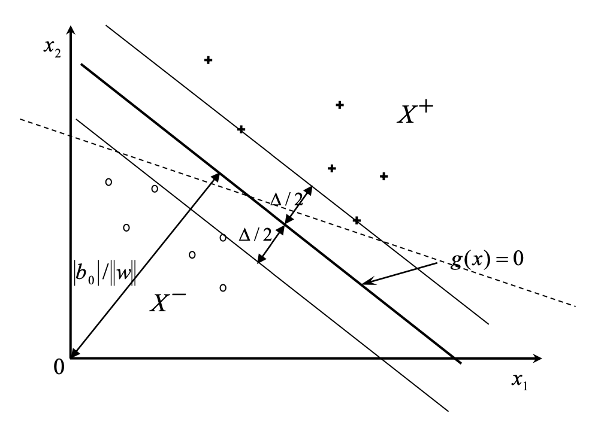

## Общая идея метода опорных векторов

Метод опорных векторов (SVM, Support Vector Machine) — метод классификации, основанный на поиске оптимальной разделяющей гиперплоскости в признаковом пространстве признаков.

Пусть каждый образ описывается вектором признаков

$$ x \in \mathbb{R}^n $$

Задана обучающая выборка двух классов в виде смешанной индексированной выборки:

$$ X = \{x^{(1)}, \dots, x^{(N)}\}, \quad D = \{d^{(1)}, \dots, d^{(N)}\} $$

где

$$ d^{(i)} = +1, \; x^{(i)} \in \omega_1 $$

$$ d^{(i)} = -1, \; x^{(i)} \in \omega_2 $$

Предполагается, что классы линейно разделимы, то есть существует гиперплоскость, однозначно разделяющая образы двух классов.

## Разделяющая гиперплоскость и классификатор

Разделяющей гиперплоскости соответствует линейная функция:

$$ g(x) = x^T w - b_0 = 0 $$

где  
$w$ — вектор весовых коэффициентов, перпендикулярный разделяющей гиперплоскости,  
$b_0$ — вспомогательная константа (смещение).

Условие линейной разделимости образов двух классов имеет вид:

$$ d^{(i)} (x^{(i)T} w - b_0) > 0, \quad i = 1,\dots,N $$

Классификатор на основе метода SVM задаётся решающим правилом:

$$ g'(x) = \text{sign}(g(x)) = \text{sign}(x^T w - b_0) $$

где

$$\text{sign}(u)=\begin{cases} +1, & u \ge 0 \\ -1, & u < 0 \end{cases}$$

## Нормировка и разделяющая полоса

Поскольку умножение $w$ и $b_0$ на произвольную константу не изменяет результатов классификации, вводят нормировку:

$$ \min_i d^{(i)} (x^{(i)T} w - b_0) = 1 $$

Тогда для всех объектов обучающей выборки выполняется:

$$ d^{(i)} (x^{(i)T} w - b_0) \ge 1 $$

Точки, для которых достигается равенство, лежат на границах разделяющей полосы.

Ширина разделяющей полосы равна:

$$ \Delta = \frac{2}{\|w\|} $$

## Геометрическая интерпретация метода

Геометрическая интерпретация метода опорных векторов в двумерном пространстве признаков показана на рис. 1. Разделяющая гиперплоскость задаётся уравнением

$$ g(x) = x^T w - b_0 = 0. $$

Параллельно ей расположены две граничные гиперплоскости

$$ g(x) = 1 \quad \text{и} \quad g(x) = -1, $$

расстояние между которыми образует разделяющую полосу шириной $\Delta$.

Точки обучающей выборки, лежащие на границах разделяющей полосы, являются опорными векторами.

Рис.1. Геометрическая иллюстрация метода SVM

## Оптимальная разделяющая гиперплоскость

Идея метода опорных векторов заключается в выборе такой разделяющей гиперплоскости, которая максимизирует ширину разделяющей полосы, то есть располагается на максимальном расстоянии от ближайших точек обоих классов.

Максимизация ширины полосы эквивалентна задаче минимизации нормы вектора $w$.

Задача оптимизации формулируется следующим образом:

$$\begin{cases}
\displaystyle \min \frac{1}{2} w^T w \\
d^{(i)} (x^{(i)T} w - b_0) \ge 1, \quad i = 1,\dots,N
\end{cases}$$

Данная задача является задачей квадратичного программирования с линейными ограничениями.

## Функция Лагранжа и двойственная задача

Для решения задачи вводятся множители Лагранжа $\lambda_i \ge 0$.

Функция Лагранжа имеет вид:

$$L(w, b_0, \lambda) =
\frac{1}{2} w^T w - \sum_{i=1}^N \lambda_i \left[ d^{(i)} (x^{(i)T} w - b_0) - 1 \right]$$

Необходимым условием седловой точки является равенство нулю производных функции Лагранжа:

$$ \frac{\partial L}{\partial w} = 0, \quad \frac{\partial L}{\partial b_0} = 0 $$

Отсюда следует:

$$ w = \sum_{i=1}^N \lambda_i d^{(i)} x^{(i)} $$

$$ \sum_{i=1}^N \lambda_i d^{(i)} = 0 $$

## Опорные векторы

Векторы обучающей выборки, для которых

$$ \lambda_i > 0 $$

участвуют в формировании решения и называются опорными векторами.

Остальные векторы не влияют на положение оптимальной разделяющей гиперплоскости.

## Вычисление смещения

Для любого граничного опорного вектора выполняется:

$$ d^{(i)} (x^{(i)T} w - b_0) = 1 $$

Отсюда:

$$ b_0 = x^{(i)T} w - d^{(i)} $$

На практике для повышения устойчивости решения используют медиану значений:

$$b_0 = \operatorname{med}\{x^{(i)T} w - d^{(i)}\}, \quad \lambda_i > 0$$

## Итоговый классификатор SVM

Окончательное решающее правило метода опорных векторов имеет вид:

$$g'(x) = \text{sign}\left( \sum_{i=1}^N \lambda_i d^{(i)} (x^{(i)T} x) - b_0 \right)$$

Классификация осуществляется на основе взвешенной суммы скалярных произведений классифицируемого вектора и опорных векторов.

## Геометрический смысл метода

• разделяющая гиперплоскость располагается посередине между классами  
• опорные векторы лежат на границах разделяющей полосы  
• максимизация ширины полосы повышает устойчивость классификатора и его обобщающую способность
