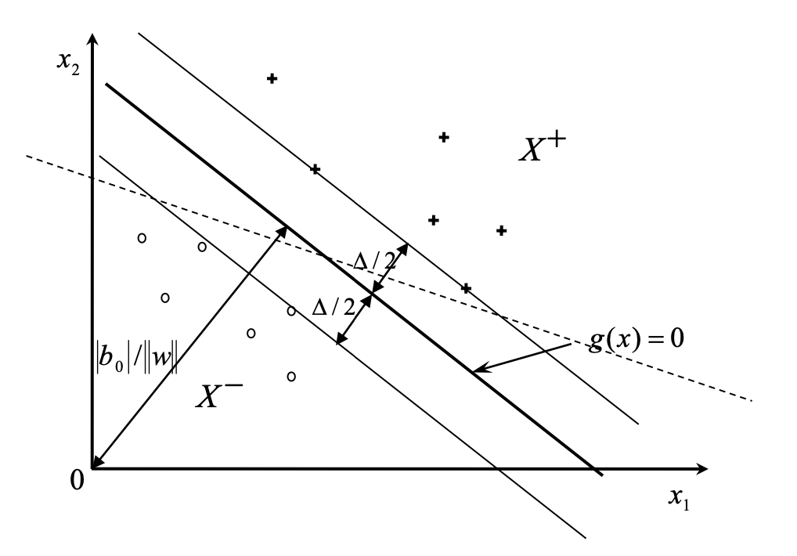

## Общая идея метода опорных векторов

Метод опорных векторов (SVM, Support Vector Machine) — метод классификации, основанный на поиске оптимальной разделяющей гиперплоскости в признаковом пространстве признаков.

Пусть каждый образ описывается вектором признаков

$$ x \in \mathbb{R}^n $$

Задана обучающая выборка двух классов в виде смешанной индексированной выборки:

$$ X = \{x^{(1)}, \dots, x^{(N)}\}, \quad D = \{d^{(1)}, \dots, d^{(N)}\} $$

где

$$ d^{(i)} = +1, \; x^{(i)} \in \omega_1 $$

$$ d^{(i)} = -1, \; x^{(i)} \in \omega_2 $$

Предполагается, что классы линейно разделимы, то есть существует гиперплоскость, однозначно разделяющая образы двух классов.

## Разделяющая гиперплоскость и классификатор

Разделяющей гиперплоскости соответствует линейная функция:

$$ g(x) = x^T w - b_0 = 0 $$

где  
$w$ — вектор весовых коэффициентов, **перпендикулярный** разделяющей гиперплоскости,  
$b_0$ — вспомогательная константа (смещение).

> [!note] сос мыслом
> $x^Tw - b_0$ - расстояние того, насколько удалена точка $x$ от плоскости (в определенном масштабе). По одну сторону плоскости - расстояния положительные, по другую - отрицательные. Тогда если домножить все на соответствующий $d^{(i)}$, который представляет из себя знак, то получим, что все выражения положительные, а из этого следует условие линейной разделимости (можно всех домножить на знак и получить что все больше 0):

Условие линейной разделимости образов двух классов имеет вид:

$$ d^{(i)} \cdot (x^{(i)T} w - b_0) > 0, \quad i = 1,\dots,N $$

Классификатор на основе метода SVM задаётся решающим правилом:

$$ g'(x) = \text{sign}(g(x)) = \text{sign}(x^T w - b_0) $$

где

$$\text{sign}(u)=\begin{cases} +1, & u \ge 0 \\ -1, & u < 0 \end{cases}$$

## Нормировка и разделяющая полоса

Поскольку умножение $w$ и $b_0$ на произвольную константу не изменяет результатов классификации, вводят нормировку:

$$ \min_i \left[ d^{(i)} \cdot (x^{(i)T} w - b_0) \right] = 1 $$

> [!note] пояснение
> Умножение на константу $k(x^Tw - b_0)$ не только не изменяет результатов классификации, полученное выражение буквально описывает ту же самую плоскость, что и $x^Tw-b_0$
> Короче чтобы ввести условие нормировки, мы просто умножили на константу. А $\min_i$ означает, что мы рассматриваем *ближайшую* точку $x^{(i)}$ к разделяющей гиперплоскости.
> 
> Короче, мы договорились, что расстояние от ближайших точек с обеих сторон до разделяющей гиперплоскости будет равно 1.

Тогда для всех объектов обучающей выборки выполняется:

$$ d^{(i)} (x^{(i)T} w - b_0) \ge 1 $$

Точки, для которых достигается равенство, лежат на границах разделяющей полосы.

Ширина разделяющей полосы равна:

$$ \Delta = \frac{2}{\|w\|} $$

> [!note] пояснение
> мы делим на норму вектора $||w||$ чтобы учесть тот масштаб, который возник при введении условия нормировки. А $2$ берется из соображений, что расстояния от гиперплоскости до ближайших точек по обе стороны - единицы.

## Геометрическая интерпретация метода

Геометрическая интерпретация метода опорных векторов в двумерном пространстве признаков показана на рис. 1. Разделяющая гиперплоскость задаётся уравнением

$$ g(x) = x^T w - b_0 = 0. $$

Параллельно ей расположены две граничные гиперплоскости

$$ g(x) = 1 \quad \text{и} \quad g(x) = -1, $$

расстояние между которыми образует разделяющую полосу шириной $\Delta$.

Точки обучающей выборки, лежащие на границах разделяющей полосы, являются опорными векторами.

Рис.1. Геометрическая иллюстрация метода SVM

## Оптимальная разделяющая гиперплоскость

Идея метода опорных векторов заключается в выборе такой разделяющей гиперплоскости, которая максимизирует ширину разделяющей полосы, то есть располагается на максимальном расстоянии от ближайших точек обоих классов.

Максимизация ширины полосы эквивалентна задаче минимизации нормы вектора $w$. 

> [!note] потому что
> ширина полосы равна $\Delta$ из формулы выше, где $w$ стоит в знаменателе. Чем меньше знаменатель -> тем меньше все значение.

Задача оптимизации формулируется следующим образом:

$$\begin{cases}
\displaystyle \min \frac{1}{2} w^T w & \text{равносильно:} & \max\frac{2}{w^Tw} = \max\frac{2}{||w||} \\
d^{(i)} (x^{(i)T} w - b_0) \ge 1, \quad i = 1,\dots,N
\end{cases}$$

Данная задача является задачей квадратичного программирования с линейными ограничениями.

## Функция Лагранжа и двойственная задача

Для решения задачи вводятся множители Лагранжа $\lambda_i \ge 0$.

Функция Лагранжа имеет вид:

> [!note] пояснение 
>  коэффициенты $\lambda_i$ выполняют роль штрафных коэффициентов. Если выражение под суммой в скобках нарушается, то есть $<0$, то тогда все значение функции растет. Если значение в скобках $=0$, то конкретное слагаемое вообще не учитывается, а если $>0$, то значение функции уменьшается. А раз мы минимизируем эту функцию, то алгоритм подстроит так, чтобы условия выполнялись.

$$L(w, b_0, \lambda) =
\frac{1}{2} w^T w - \sum_{i=1}^N \lambda_i \left[ d^{(i)} \cdot (x^{(i)T} w - b_0) - 1 \right]$$

Чтобы найти точку минимума, нужно приравнять производные к нулю:

$$ \frac{\partial L}{\partial w} = 0, \quad \frac{\partial L}{\partial b_0} = 0 $$

> [!note] возьмем производную
> 
> $$ L = \underbrace{\frac{1}{2}w^T w}_{\text{Зависит от } w} - \underbrace{\sum_{i=1}^{N} \lambda_i d^{(i)} x^{(i)T} w}_{\text{Зависит от } w} + \underbrace{\sum_{i=1}^{N} \lambda_i d^{(i)} b_0}_{\text{Зависит от } b_0} + \underbrace{\sum_{i=1}^{N} \lambda_i}_{\text{Константа}} $$
> 
> $$ \frac{\partial}{\partial w} (\frac{1}{2}w^T w) = w $$
> 
> $$ \frac{\partial}{\partial w} \left( \sum_{i=1}^{N} \lambda_i d^{(i)} x^{(i)T} w \right) = \sum_{i=1}^{N} \lambda_i d^{(i)} x^{(i)} $$
> 
> $$ \frac{\partial L}{\partial w} = w - \sum_{i=1}^{N} \lambda_i d^{(i)} x^{(i)} $$
> 
> $$ \frac{\partial L}{\partial b_0} = \sum_{i=1}^{N} \lambda_i d^{(i)} $$

Отсюда следует:

$$ w = \sum_{i=1}^N \lambda_i d^{(i)} x^{(i)} $$

$$ \sum_{i=1}^N \lambda_i d^{(i)} = 0 $$

## Опорные векторы

Векторы обучающей выборки $x_i$, для которых

$$ \lambda_i > 0 $$

участвуют в формировании решения и называются **опорными векторами**.

Остальные векторы не влияют на положение оптимальной разделяющей гиперплоскости.

## Вычисление смещения

Для любого граничного опорного вектора выполняется:

$$ d^{(i)} \cdot (x^{(i)T} w - b_0) = 1 $$

$\frac{1}{d} = d$, отсюда:

$$ b_0 = x^{(i)T} w - d^{(i)} $$

На практике для повышения устойчивости решения используют медиану значений:

$$b_0 = \operatorname{med}\{x^{(i)T} w - d^{(i)}\}, \quad \lambda_i > 0$$

## Итоговый классификатор SVM

Окончательное решающее правило метода опорных векторов имеет вид:

$$g'(x) = \text{sign}\left( \sum_{i=1}^N \lambda_i d^{(i)} \cdot (x^{(i)T} x) - b_0 \right)$$

Классификация осуществляется на основе взвешенной суммы скалярных произведений классифицируемого вектора и опорных векторов.

## Геометрический смысл метода

• разделяющая гиперплоскость располагается посередине между классами  
• опорные векторы лежат на границах разделяющей полосы  
• максимизация ширины полосы повышает устойчивость классификатора и его обобщающую способность
